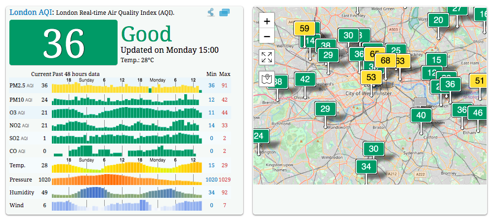
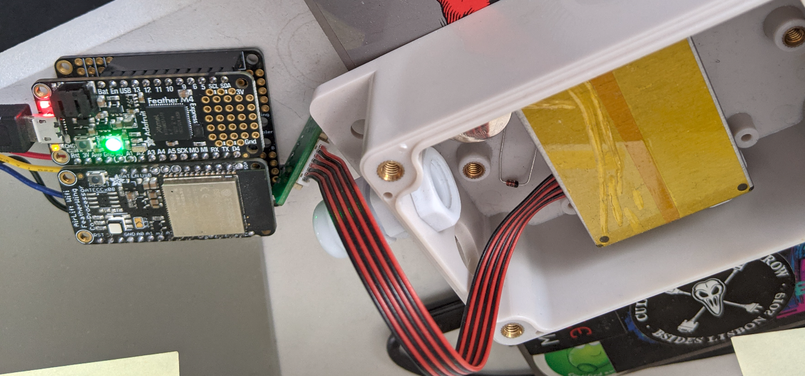
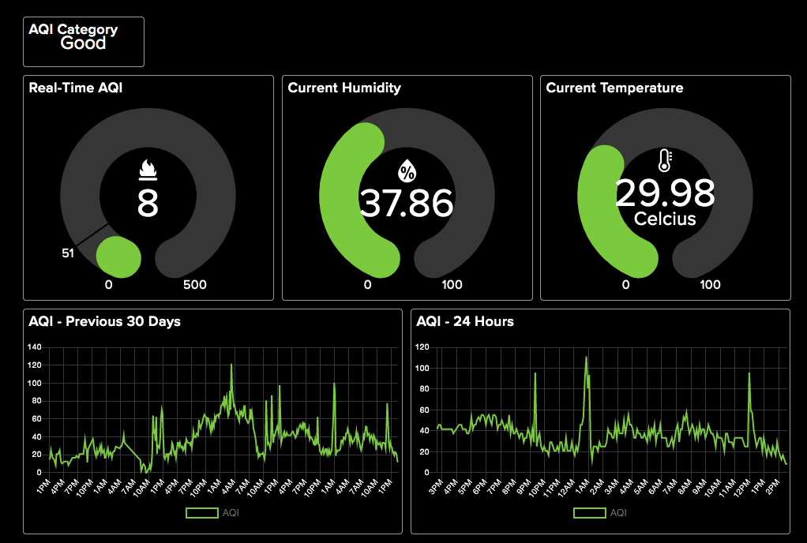
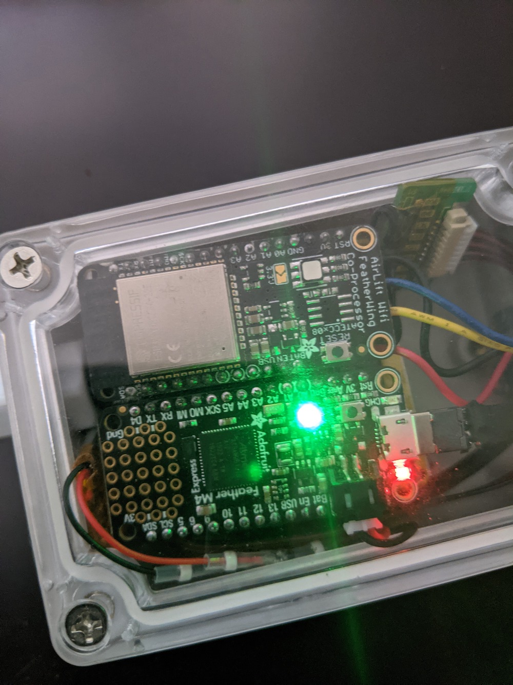

<<<<<<< HEAD
# Air Quality Sensor

This project is about building a cheap, but usable, air quality sensor for your house. It allows sampling and tracking of 2.5 micro particles (PM2.5) found in the air and takes that data and uploads it to Adafruits brilliant io.adafruit.com. 

Firstly what are PM 2.5 particles?

Particulate matter (PM) 2.5 refers to a category of particulate pollutant that is 2.5 microns or smaller in size. High levels of PM 2.5 can have serious health consequences for all of us as they are able to bypass the body's defensive systems. They come from a variety of sources, for example cars and this is what started my obsession with this project, living in London we face high levels on a daily basis and I wanted to understand how bad it was.  

## Bill of Materials

In order this to work, you'll need the following:

1. [Adafruit Feather M4 Express](https://www.adafruit.com/product/3857)
2. [Adafruit Airlift FeatherWing](https://www.adafruit.com/product/4264)
3. [PM2.5 Air Quality Sensor](https://www.adafruit.com/product/3686) 
4. [BME 280 I2C/SPI Temperature Humidity Sensor](https://www.adafruit.com/product/2652)
5. [FeatherWing Doubler](https://www.adafruit.com/product/2890) - Optional but I found it makes stuff cleaner and easier to work with
6. Some kind of weather sensor box. The choice is yours
7. Long Micro USB cable - depending on where you install this, you might need a shorter one
8. Lithium Ion Polymer battery (3.7v)
9. Silicon wire (to hook the PM2.5 up to the FeatherWing Doubler)

Along with the above, you'll need a soldering station, some wires and solder and wire strippers. The following needs to be connected:

[**BME280**](https://cdn-learn.adafruit.com/downloads/pdf/adafruit-bme280-humidity-barometric-pressure-temperature-sensor-breakout.pdf)

- **Board SDA** to **sensor SDI**
- **Board GND** to **sensor GND**
- **Board 3V** to **sensor CS**
- **Board SCL** to **sensor SCK**
- **Board 3V** to **sensor VIN**

[**PM2.5**](https://cdn-learn.adafruit.com/downloads/pdf/pm25-air-quality-sensor.pdf)

- **Sensor TX** to **board RX**
- **Sensor VCC** to **board 5V**
- **Sensor GND** to **board GND**

When you solder the Feather M4 pins, make sure you do the pins correctly. It should look like this once done

Depending on the enclosure you got, this will determine the fitment. In my case, I got the wrong one and ended up with a weatherproof one. This is pretty small and I feel the airflow isn't as good as it should be so the temperature figures are incorrect. 

## Adafruit IO

Head on over to [io.adafruit.com](https://io.adafruit.com/) and create an account (enable 2FA too!)

We will make use of 5 feeds for this project, so you'll need to create them. The steps you should take are:

1. Create a new group called Air Quality Sensor

2. Go into actions --> create a new feed and create the following:

   1. AQI
   2. Battery
   3. Temperature
   4. Humidity
   5. Category

3. Under actions, create a new dashboard (call it what ever you want)

4. Now we need to add buttons to the dashboard. These are called blocks and here is how I've organised my blocks

   

## Code

The code is written for [CircuitPython](https://github.com/adafruit/circuitpython/releases) 7 and youll need the following [libraries](https://learn.adafruit.com/welcome-to-circuitpython/circuitpython-libraries) installed on the board:

1. **adafruit_bme280**
2. **adafruit_bus_device**
3. **adafruit_io**
4. **adafruit_pm25**
5. **adafruit_requests.mpy**
6. **adafruit_logging.mpy**
7. **adafruit_esp32spi**
8. **simpleio.mpy**

Once you've added the required information in the secrets.py (you need to rename it), power the board up and you should see it mounted as CIRCUITPY. Copy all the libraries and code to the root and if all goes well, you should see a green light. If not, connect a serial console over to the power and see what the error(s) are. 

As I said earlier, the case you choose is really important. I've found the BME280 to be sensitive to light and heat and both boards seem to kick off a fair amount to skew the readings. Placement is also important. 

Depending on the case you choose, you might need to cut down the USB cable to fit. I had to remove all the plastic shielding to get it into the weatherproof holes, which is a pain but not hard. 

### Roadmap and Ideas

The more I play with this, the more I want to perform more analysis on the data being received. For example, I want push notifications when the AQI goes over a certain level. I've done this using IFTTT, which is amazing but I think you could do better. Then logging, right now all the data is pushed to Adafruit and stored for 30 days only. I can manually download it but I need to remind myself to do this so eventually I need to write some logging function to push it to a server I control for archiving. 

You can add a battery and I have indeed done this myself and added the code to alert on the overall level of the battery but I feel it could be made better, so working on that. 
=======
#Simple IoT pollution sensor

This is a relatively simple IoT pollution sensor. I shall update the readme in due course 
>>>>>>> 2da9bfb17a37cf54cfb84ad6b6b115ef799f0b3b
